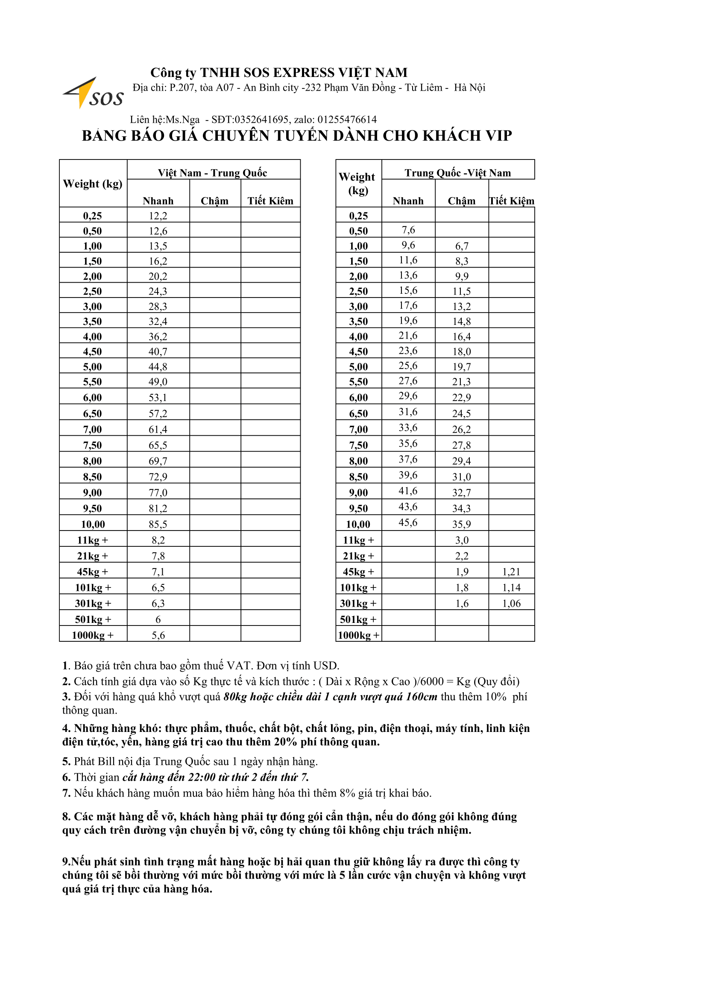
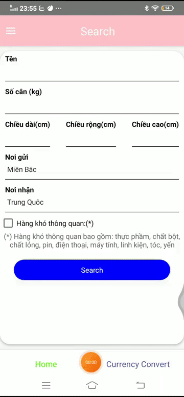

# Tra giá cước vận chuyển 
Ứng dụng sử dụng cho khách hàng có nhu cầu vận chuyển hàng hóa, có thể là đồ dùng cá nhân, thực phẩm, thuốc,... 
+ Tra bảng gía phí vận chuyển qua ứng dụng
+ Nhập tên, địa chỉ gửi nhận và số cân, kích thước hàng ứng dụng sẽ tra bảng giá (hiện tại mặc định là từ miền bắc - Trung Quốc)
+ Khách hàng có thể xem phí vận chuyển, chuyển đổi sang tiền tệ muốn chi trả như USD, Tệ,...
+ Chức năng chuyển đổi tiền tệ

# Bảng giá và các yêu cầu

# Demo
+ Chức năng "contact us" tuy hiển thị trên giao diện nhưng chưa thực hiện nhiệm vụ nào.

